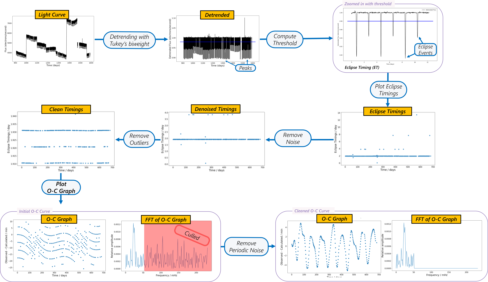

# Tris

Welcome to the Tris Documentation!

**Tris** (**Tri**nary **S**creener) is an open-source tool that offers a specialized method to determine "observed-minus-computed" (OC) diagrams from 
astronomical flux time series data (lightcurves) obtained from NASA's Kepler and K2 missions.

Here is a brief outline of the algorithm:

     
    Diagram of Algorithm.

In this documentation, we detail various methods to use our algorithm.